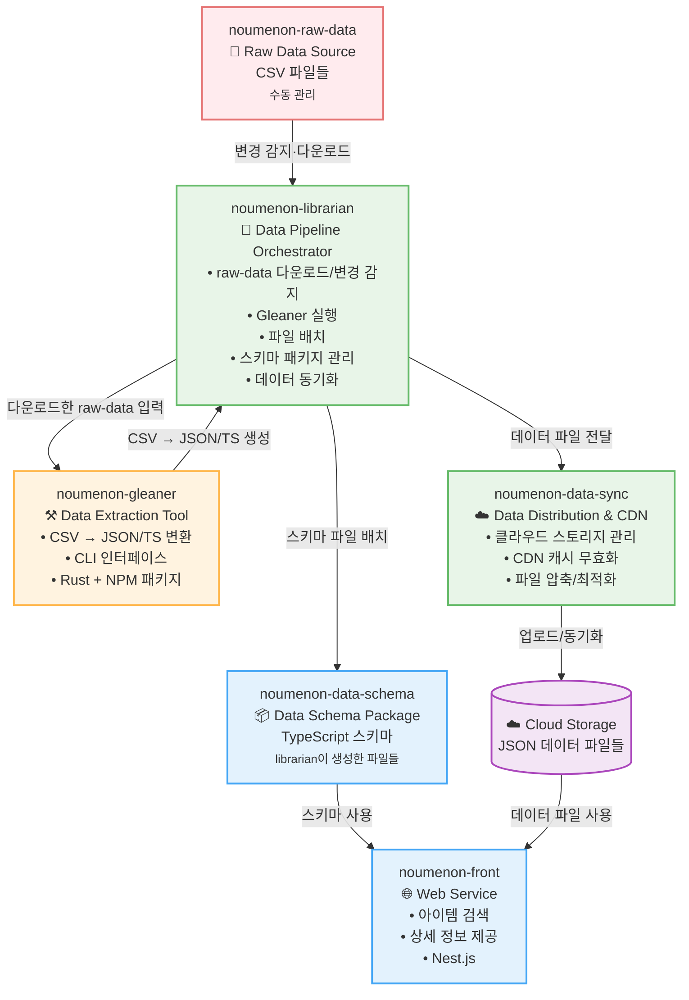

# 서비스 아키텍처 다이어그램 (by Claude 4 Sonnet)

```mermaid
graph TB
    %% Raw Data Source
    RawData[noumenon-raw-data<br/>📁 Raw Data Source<br/>CSV 파일들<br/><small>수동 관리</small>]

    %% Data Pipeline
    Librarian[noumenon-librarian<br/>🔄 Data Pipeline Orchestrator<br/>• raw-data 다운로드/변경 감지<br/>• Gleaner 실행<br/>• 파일 배치<br/>• 스키마 패키지 관리<br/>• 데이터 동기화]

    %% Data Extraction Tool
    Gleaner[noumenon-gleaner<br/>⚒️ Data Extraction Tool<br/>• CSV → JSON/TS 변환<br/>• CLI 인터페이스<br/>• Rust + NPM 패키지]

    %% Schema Package
    Schema[noumenon-data-schema<br/>📦 Data Schema Package<br/>TypeScript 스키마<br/><small>librarian이 생성한 파일들</small>]

    %% Data Distribution
    DataSync[noumenon-data-sync<br/>☁️ Data Distribution & CDN<br/>• 클라우드 스토리지 관리<br/>• CDN 캐시 무효화<br/>• 파일 압축/최적화]

    %% Web Service
    Front[noumenon-front<br/>🌐 Web Service<br/>• 아이템 검색<br/>• 상세 정보 제공<br/>• Nest.js]

    %% Cloud Storage
    Cloud[(☁️ Cloud Storage<br/>JSON 데이터 파일들)]

    %% Relationships
    RawData -->|변경 감지·다운로드| Librarian
    Librarian -->|다운로드한 raw-data 입력| Gleaner
    Gleaner -->|CSV → JSON/TS 생성| Librarian
    Librarian -->|스키마 파일 배치| Schema
    Librarian -->|데이터 파일 전달| DataSync
    DataSync -->|업로드/동기화| Cloud
    Schema -->|스키마 사용| Front
    Cloud -->|데이터 파일 사용| Front

    %% Styling
    classDef rawData fill:#ffebee,stroke:#e57373,stroke-width:2px
    classDef pipeline fill:#e8f5e8,stroke:#66bb6a,stroke-width:2px
    classDef tool fill:#fff3e0,stroke:#ffb74d,stroke-width:2px
    classDef service fill:#e3f2fd,stroke:#42a5f5,stroke-width:2px
    classDef storage fill:#f3e5f5,stroke:#ab47bc,stroke-width:2px

    class RawData rawData
    class Librarian,DataSync pipeline
    class Gleaner tool
    class Front,Schema service
    class Cloud storage
```
