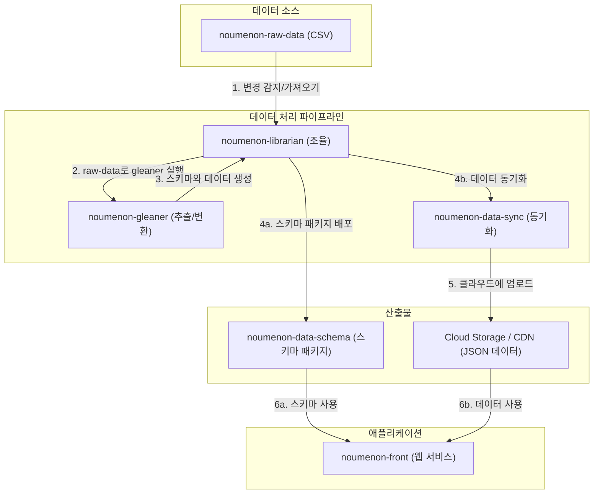

# 서비스 아키텍처 다이어그램 (by Gemini 2.5 Pro)

```mermaid
graph TD
subgraph "데이터 소스"
raw_data["noumenon-raw-data (CSV)"]
end

    subgraph "데이터 처리 파이프라인"
        librarian["noumenon-librarian (조율)"]
        gleaner["noumenon-gleaner (추출/변환)"]
        data_sync["noumenon-data-sync (동기화)"]
    end

    subgraph "산출물"
        schema_pkg["noumenon-data-schema (스키마 패키지)"]
        cloud["Cloud Storage / CDN (JSON 데이터)"]
    end

    subgraph "애플리케이션"
        front["noumenon-front (웹 서비스)"]
    end

    raw_data -- "1. 변경 감지/가져오기" --> librarian
    librarian -- "2. raw-data로 gleaner 실행" --> gleaner
    gleaner -- "3. 스키마와 데이터 생성" --> librarian
    librarian -- "4a. 스키마 패키지 배포" --> schema_pkg
    librarian -- "4b. 데이터 동기화" --> data_sync
    data_sync -- "5. 클라우드에 업로드" --> cloud

    schema_pkg -- "6a. 스키마 사용" --> front
    cloud -- "6b. 데이터 사용" --> front
```
