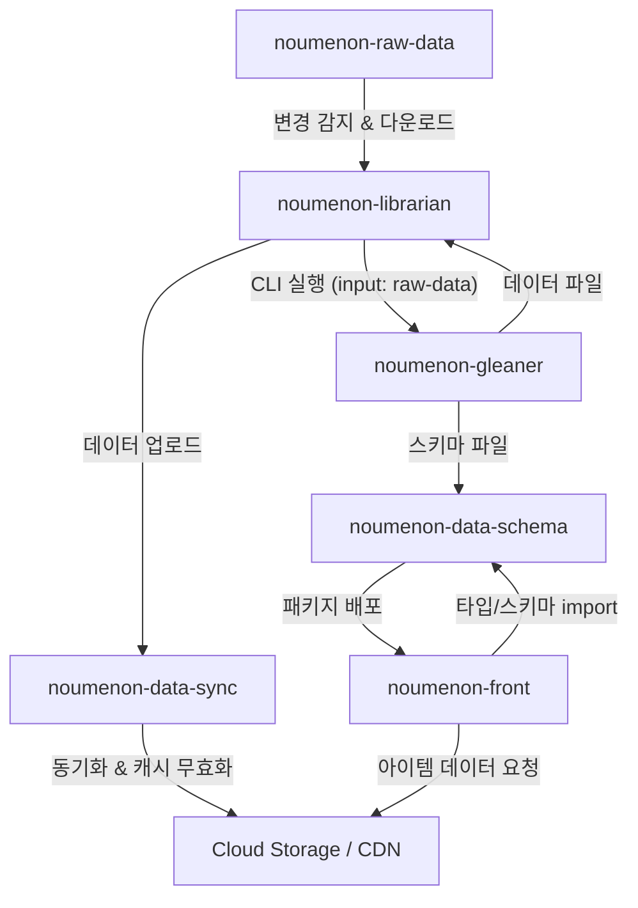

# 서비스 아키텍처 다이어그램 (by O3)

```mermaid
%% Updated Architecture Diagram
flowchart TD
    %% Raw data source
    rawData["noumenon-raw-data"]

    %% Data pipeline orchestrator
    librarian["noumenon-librarian"]

    %% Data extractor CLI
    gleaner["noumenon-gleaner"]

    %% Schema package
    schemaPkg["noumenon-data-schema"]

    %% Data sync & CDN
    dataSync["noumenon-data-sync"]
    cloudCDN["Cloud Storage / CDN"]

    %% Web service
    front["noumenon-front"]

    %% ----------- Data Flow -----------
    %% 1) Raw-data 감지 및 다운로드
    rawData -- "변경 감지 & 다운로드" --> librarian

    %% 2) Librarian ⇒ Gleaner
    librarian -- "CLI 실행 (input: raw-data)" --> gleaner

    %% 3) Gleaner 결과물
    gleaner -- "스키마 파일" --> schemaPkg
    gleaner -- "데이터 파일" --> librarian

    %% 4) Librarian ⇒ Data Sync
    librarian -- "데이터 업로드" --> dataSync

    %% 5) Data Sync ⇒ Cloud/CDN
    dataSync -- "동기화 & 캐시 무효화" --> cloudCDN

    %% 6) SchemaPkg Publish (NPM)
    schemaPkg -- "패키지 배포" --> front

    %% 7) Front-end dependencies
    front -- "아이템 데이터 요청" --> cloudCDN
    front -- "타입/스키마 import" --> schemaPkg
```
